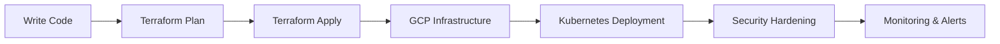

````markdown
<!-- ======================= -->
<!-- 🚀 HERO SECTION -->
<!-- ======================= -->

<h1 align="center">⚡ Thomas Bell ⚡</h1>

<h3 align="center">
☁️ Cloud Security Engineer in Progress | GCP • Terraform • Kubernetes • DevSecOps
</h3>

<p align="center">

</p>

<p align="center">

</p>

---

<!-- ======================= -->
<!-- 🧠 ABOUT -->
<!-- ======================= -->

## 🧠 Identity

```yaml
name: Thomas Bell
role: Cloud Security Engineer (In Progress)
location: Massachusetts, USA

specialties:
  - Cloud Security (GCP)
  - Infrastructure as Code (Terraform)
  - Container Security (Kubernetes)
  - DevSecOps Automation

mindset: >
  Automate everything.
  Secure by default.
  Scale without fear.
````

---

<!-- ======================= -->

<!-- 🚀 CURRENT OPS -->

<!-- ======================= -->

## 🚀 Current Operations

```bash
> initializing_cloud_journey.sh

[✔] Learning Terraform modules
[✔] Deploying GCP labs
[✔] Studying IAM + Security Architecture
[✔] Breaking & fixing Kubernetes configs
[➜] Preparing for PCA Certification...
```

---

<!-- ======================= -->

<!-- 🎯 CERT TRACKER -->

<!-- ======================= -->

## 🎯 Certification Pipeline

| Certification                               | Status         |
| ------------------------------------------- | -------------- |
| Google Associate Cloud Engineer             | 🟡 In Progress |
| Google Professional Cloud Security Engineer | 🔵 Loading...  |

---

<!-- ======================= -->

<!-- ⚙️ TECH STACK -->

<!-- ======================= -->

## ⚙️ Tech Arsenal

<p align="center">

</p>

---

<!-- ======================= -->

<!-- 🛰️ CLOUD BADGES -->

<!-- ======================= -->

## 🛰️ Cloud + DevSecOps

<p align="center">


</p>

---

<!-- ======================= -->

<!-- 🤖 AUTOMATION VISUAL -->

<!-- ======================= -->

## 🤖 Automation Pipeline



---

<!-- ======================= -->

<!-- 📊 GITHUB STATS -->

<!-- ======================= -->

## 📊 GitHub Command Center

<p align="center">

</p>

<p align="center">

</p>

<p align="center">

</p>

---

<!-- ======================= -->

<!-- 🚀 FEATURED PROJECTS -->

<!-- ======================= -->

## 🚀 Featured Deployments

<p align="center">
<a href="https://github.com/thomas065/terraformblues">

</a>

<a href="https://github.com/thomas065/GCP-Class_Notes">

</a>
</p>

---

<!-- ======================= -->

<!-- 📡 LIVE STATUS -->

<!-- ======================= -->

## 📡 Live System Status

```diff
+ Cloud Security Mode: ACTIVE
+ Terraform Deployments: RUNNING
+ Kubernetes Cluster: HEALTHY
! Sleep Schedule: NOT FOUND
```

---

<!-- ======================= -->

<!-- 🌐 CONNECT -->

<!-- ======================= -->

## 🌐 Connect

<p align="center">
<a href="http://thomasjbell.netlify.app/">

</a>

<a href="mailto:thomasjbell065@gmail.com">

</a>

<a href="https://www.linkedin.com/in/thomasjbell065">

</a>
</p>

---

<!-- ======================= -->

<!-- ⚡ SECRET -->

<!-- ======================= -->

## ⚡ System Secret

```bash
> echo $SECRET_WORD
SHAZZAM ⚡
```

---

<!-- ======================= -->

<!-- 🌊 FOOTER -->

<!-- ======================= -->

<p align="center">

</p>
```
