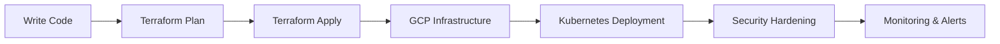

# ⚡ Hi ,  I'm Thomas Bell

### ☁️ Cloud Security Engineer in Progress  
**GCP • Terraform • Kubernetes • DevSecOps**

[](https://git.io/typing-svg)

---

## 🧠 Identity

```yaml
name: Thomas Bell
location: Massachusetts, USA
focus: Cloud Security Engineering (GCP)

learning:
  - Terraform (Infrastructure as Code)
  - Kubernetes (Container Security)
  - GCP IAM & Security Architecture

mission: >
  Build secure, scalable, automated cloud systems
````

---

## 🚀 Current Operations

```bash
> initializing_cloud_journey.sh

[✔] Learning Terraform modules
[✔] Deploying GCP labs
[✔] Studying IAM policies
[✔] Breaking & fixing Kubernetes configs
[➜] Preparing for PCA Certification...
```

---

## 🎯 Certification Pipeline

* 🟡 Google Associate Cloud Engineer (In Progress)
* 🔵 Google Professional Cloud Security Engineer (Next)

---

## ⚙️ Tech Stack


---

## 🛰️ Cloud & DevSecOps


---

## 🤖 Automation Pipeline



---

## 📊 GitHub Stats


---

## 🚀 Featured Projects

[](https://github.com/thomas065/terraformblues)

[](https://github.com/thomas065/GCP-Class_Notes)

---

## 📡 System Status

```diff
+ Cloud Security Mode: ACTIVE
+ Terraform Deployments: RUNNING
+ Kubernetes Cluster: HEALTHY
! Sleep Schedule: NOT FOUND
```

---

## 🌐 Connect

* 🌍 Portfolio: http://thomasjbell.netlify.app/
* ✉️ Email: [thomasjbell065@gmail.com](mailto:thomasjbell065@gmail.com)
* 💼 LinkedIn: https://www.linkedin.com/in/thomasjbell065

---

## ⚡ Fun Fact

```bash
> echo $SECRET_WORD
SHAZZAM ⚡
```

```
```
